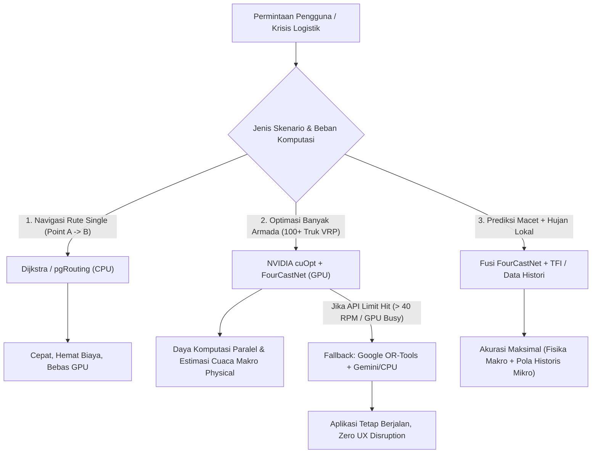

# FEATURE STATUS — PetaNadi (LRIP) System Matrix

**Last Updated:** 2026-07-20  
**Active Milestone:** M1 — Hackathon MVP (North Sumatra Corridor)  
**Architectural Blueprint:** Hybrid Cognitive Swarm (Dijkstra + NVIDIA cuOpt + FourCastNet + OR-Tools Fallback)  
**Reference Documents:** [.planning/STATE.md](file:///c:/Farras/DIGDAYA/peta-nadi/.planning/STATE.md), [.planning/ROADMAP.md](file:///c:/Farras/DIGDAYA/peta-nadi/.planning/ROADMAP.md), [AUDIT_NOTES.md](file:///c:/Farras/DIGDAYA/peta-nadi/AUDIT_NOTES.md), [Submission Tahap 2 (3) - compiled.md](file:///c:/Farras/DIGDAYA/peta-nadi/docs/Submission%20Tahap%202%20%283%29%20-%20compiled.md), [combine_technical.md](file:///c:/Farras/DIGDAYA/peta-nadi/combine_technical.md)

---

## 1. Sudah Berfungsi (Functional & Fully Integrated)

Seluruh fitur di bawah ini telah diimplementasikan, diuji, dan berfungsi secara penuh pada aplikasi:

| Fitur / Komponen | Modul Kode Utama | Status Deskripsi |
| :--- | :--- | :--- |
| **Guided Demo Runner & Stepper Panel** | [GuidedDemoPanel.tsx](file:///c:/Farras/DIGDAYA/peta-nadi/frontend/components/demo/GuidedDemoPanel.tsx), [useDemoState.ts](file:///c:/Farras/DIGDAYA/peta-nadi/frontend/hooks/useDemoState.ts) | 5-stage interactive stepper (`Injecting Events` -> `Agent Swarm` -> `Consensus Gate` -> `Validated Alert` -> `Notification Sent`). Dilengkapi mode otomatis, pacing 15s, generator QR code remote HP, dan penanganan loop re-render bebas crash. |
| **Backend Demo Engine & Auto-Fallback** | [demo_router.py](file:///c:/Farras/DIGDAYA/peta-nadi/backend/app/routers/demo_router.py) | Router backend `/api/demo/start`, `/api/demo/status/{id}`, `/api/demo/advance/{id}`. Mendukung eksekusi real swarm maupun auto-fallback ke `mock_crisis_state.json` (menjamin HTTP 200 OK tanpa error 500/404). |
| **3D Globe Mode & Pin Anchoring** | [CrisisMap.tsx](file:///c:/Farras/DIGDAYA/peta-nadi/frontend/components/map/CrisisMap.tsx), [layers.ts](file:///c:/Farras/DIGDAYA/peta-nadi/frontend/lib/layers.ts) | Peta Mapbox v3 GL dengan proyeksi 3D globe (`projection: { name: 'globe' }`) dan Deck.gl `ScatterplotLayer` ber-billboard (`billboard: true`, 0 elevation). Pin hotspot krisis terkunci 100% pada koordinat geografis tanpa melayang saat rotasi/zoom. |
| **Interactive Disruption Drawing Tool** | [CrisisMap.tsx](file:///c:/Farras/DIGDAYA/peta-nadi/frontend/components/map/CrisisMap.tsx), MapboxDraw | Tombol "SIMULATE DISRUPTION" mengalihkan `pointer-events` overlay Deck.gl, mengubah kursor ke pen crosshair (`crosshair`), dan menangkap gambar poligon GeoJSON untuk memicu simulasi insiden secara langsung. |
| **Logistics Corridor Route Polylines** | [layers.ts](file:///c:/Farras/DIGDAYA/peta-nadi/frontend/lib/layers.ts), [mock_crisis_state.json](file:///c:/Farras/DIGDAYA/peta-nadi/data/fixtures/mock_crisis_state.json) | Visualisasi rute pengalihan beresolusi tinggi sepanjang Koridor Tol Medan-Tebing Tinggi / Jalinsum (Belawan -> Tanjung Mulia -> Amplas -> Lubuk Pakam -> Perbaungan -> Tebing Tinggi -> Pematangsiantar) dengan sambungan halus (`jointRounded: true`, `capRounded: true`). |
| **AI Advisor Multilingual Chat** | [agent_router.py](file:///c:/Farras/DIGDAYA/peta-nadi/backend/app/routers/agent_router.py), `LLMGateway` | Endpoint `/api/simulation/chat` dengan sistem adaptasi bahasa otomatis (merespon dalam Bahasa Indonesia jika prompt menggunakan Bahasa Indonesia) serta fallback taktis Bahasa Indonesia untuk mode offline. |
| **Executive Cabinet Briefing PDF Export** | [ReportsSection.tsx](file:///c:/Farras/DIGDAYA/peta-nadi/frontend/components/dashboard/ReportsSection.tsx) | Tombol "Generate PDF Report" memicu jendela cetak dokumen resmi *PetaNadi National Logistics Cabinet Briefing* (`window.print()`) dan tombol "Export Raw Data" mengunduh JSON telemetry mentah. |
| **LangGraph 6-Agent Cognitive Swarm** | `agents/` (`nodes/`, `state.py`, `llm_gateway.py`) | Alur orkestrasi 6 agen cerdas (Data Collection, OSINT/Hazard, Prediction, Route Optimization, Economic Intel, Decision Support Copilot). |
| **Consensus Gate Engine** | [consensus_gate.py](file:///c:/Farras/DIGDAYA/peta-nadi/agents/tools/consensus_gate.py) | Gerbang validasi multi-sensor dengan threshold keyakinan $> 85\%$ dan syarat minimal **2 sumber data independen** sebelum insiden diklasifikasikan sebagai `"validated"`. |
| **WhatsApp Alert & Approval Logging** | [notification_service.py](file:///c:/Farras/DIGDAYA/peta-nadi/backend/app/services/notification_service.py), [approvals.py](file:///c:/Farras/DIGDAYA/peta-nadi/backend/app/routers/approvals.py) | Integrasi WhatsApp Business API untuk pengiriman ringkasan krisis + deep-link ke operator, serta pencatatan log keputusan operator pada tabel `route_approvals`. |
| **Stitch Unified Design Views** | [AnalyticsSection.tsx](file:///c:/Farras/DIGDAYA/peta-nadi/frontend/components/dashboard/AnalyticsSection.tsx), [SimulationSection.tsx](file:///c:/Farras/DIGDAYA/peta-nadi/frontend/components/dashboard/SimulationSection.tsx), [ReportsSection.tsx](file:///c:/Farras/DIGDAYA/peta-nadi/frontend/components/dashboard/ReportsSection.tsx) | Integrasi antarmuka Price Tracker Nusantara, Mitigation Sandbox, dan Cabinet Briefing Executive Summary ke dalam tab navigasi utama. |

---

## 2. Masih Berupa Simulasi / Stub (Simulated & Mock-Seeded)

Fitur yang menggunakan komponen simulasi, fixture data sintetis, atau perhitungan in-memory:

| Fitur / Komponen | Modul Kode Utama | Detail Status Simulasi |
| :--- | :--- | :--- |
| **Synthetic Incident Stream Generator** | [belawan_scenario.json](file:///c:/Farras/DIGDAYA/peta-nadi/data/synthetic/belawan_scenario.json), [run_demo.py](file:///c:/Farras/DIGDAYA/peta-nadi/run_demo.py) | Injeksi peristiwa sintetis (cuaca BMKG, kemacetan TomTom, banjir, lonjakan PIHPS) ke Redis Streams untuk mendemonstrasikan alur krisis tanpa bergantung pada API eksternal live. |
| **GraphRAG Causal Chain Seeding** | `agents/tools/graphrag_tool.py`, [mock_crisis_state.json](file:///c:/Farras/DIGDAYA/peta-nadi/data/fixtures/mock_crisis_state.json) | Knowledge graph hubungan sebab-akibat (contoh: *Belawan Port Closure* -> *Cooking Oil Supply Drop* -> *Medan Inflation*) dimuat dari dataset seed lokasi Koridor Sumut. |
| **LTM Historical Disaster Memories** | `agents/memory/ltm_db.py` | Pencarian memori jangka panjang (LTM) episode bencana masa lalu berbasis pgvector menggunakan fixture histori sintetis untuk menghitung multiplier inflasi. |
| **Source Health Live Monitors** | [ReportsSection.tsx](file:///c:/Farras/DIGDAYA/peta-nadi/frontend/components/dashboard/ReportsSection.tsx), [health.py](file:///c:/Farras/DIGDAYA/peta-nadi/backend/app/routers/health.py) | Status kesehatan adaptor data (BMKG, TomTom, AISstream) dikalkulasikan dari respons health check adaptor backend. |

---

## 3. Sedang Dikembangkan & Pendekatan Teknis Hibrida (Phase 12-13 Complete, Phase 14 Active)

### 3.1 Pendekatan Arsitektur Optimasi Rute & Prediksi Hibrida ([combine_technical.md](file:///c:/Farras/DIGDAYA/peta-nadi/combine_technical.md))

PetaNadi menggabungkan metode algoritma konvensional ringan dengan akselerasi NVIDIA AI/GPU untuk efisiensi komputasi, keandalan tinggi, dan keberlanjutan biaya:

#### Rincian Kombinasi Teknis:
1. **Pencarian Rute Dasar (Point A ke B)**: Menggunakan **Dijkstra / pgRouting (CPU)** — *Sangat cepat, efisien, tidak memerlukan GPU.*
2. **Optimasi Rute Skala Besar (100+ Truk Pengiriman VRP)**: Menggunakan **NVIDIA cuOpt + FourCastNet (GPU)** — *Memproses constraint kapasitas, jendela waktu, dan estimasi cuaca fisik secara paralel.*
3. **Mekanisme Fallback API Limit (> 40 RPM Rate Limit)**: Menggunakan **Google OR-Tools + Gemini Flash (CPU)** — *Menjamin platform tidak pernah down atau hang saat traffic meningkat.*
4. **Prediksi Disrupsi Kombinasi (Macet + Hujan Lokal)**: Menggabungkan **FourCastNet (Fisika Makro)** dengan **Temporal Fusion Transformer (TFI) / Histori Mikro** — *Akurasi tinggi dari fusi cuaca atmosfer makro dan tren historis koridor lokal.*

---

### 3.2 Pekerjaan Aktif Phase 14 (UI/UX Layout, Toast Notifications & Navigation State)

- **Audit Spacing & Margin Components**: Memperbaiki tata letak dan padding antar widget pada halaman Analytics, Simulation, dan Reports agar tidak ada yang bertabrakan.
- **Migrasi Pop-up Alert ke UI Toast Notification**: Mengganti `alert()` JS browser (contoh: pada tombol *"Assign Parameters"*) dengan UI Toast notification glassmorphism yang modern.
- **Harmonisasi Navigasi Sidebar vs Bottombar**: Menyinkronkan visibilitas dan status bottombar saat berpindah halaman dari Map ke Analytics, Simulation, dan Reports.

---

## 4. Masih Direncanakan (Phase 15 & Roadmap Submission Tahap 2)

Daftar fitur sesuai dokumen proposal resmi ([Submission Tahap 2 (3) - compiled.md](file:///c:/Farras/DIGDAYA/peta-nadi/docs/Submission%20Tahap%202%20%283%29%20-%20compiled.md)) yang dijadwalkan pada Phase 15 dan pengembangan pasca-hackathon (v2):

| Fitur / Komponen | Target Fase | Spesifikasi & Deskripsi Proposal |
| :--- | :--- | :--- |
| **4D Logistics Vehicle Animation Layers** | **Phase 15** | Layer animasi ikon armada logistik yang bergerak secara real-time / simulasi di atas peta 4D:   • **Truk Logistik**: Bergerak di Koridor Jalan Tol Medan-Tebing Tinggi / Jalinsum (Armada BULOG & Komersial).   • **Kapal Kargo**: Bergerak di jalur pelayaran Pelabuhan Belawan & Selat Malaka (AISstream integration).   • **Pesawat Kargo**: Layer kargo udara regional. |
| **Aplikasi Mobile Pengemudi Logistik** | **v2 / Post-MVP** | Aplikasi Android/iOS berbasis React Native + WatermelonDB dengan sinkronisasi offline CRDT untuk pengemudi truk di lapangan, menerima arahan pengalihan rute instan via WhatsApp / App push. |
| **Pengembangan Koridor Multi-Provinsi** | **v2 / Post-MVP** | Perluasan cakupan sistem pemantauan dari Koridor Sumatra Utara menuju Koridor Logistik Prioritas Trans-Jawa. |
| **National Logistics Health Index API** | **v2 / Post-MVP** | Endpoint API publik untuk kementerian dan otoritas pelabuhan guna mengakses indeks kesehatan logistik nasional secara real-time. |
| **GraphRAG Enterprise Private Deployment** | **v2 / Post-MVP** | Skalabilitas knowledge graph rantai pasok untuk integrasi private cloud kementerian (Kemendag, Kemenhub, BNPB, Bapanas, Bulog). |

---

## 🔐 Ringkasan Kepatuhan & Keamanan (UU No. 27/2022 PDP)

- **Data Minimization & Privacy-by-Design**: Sistem tidak menyimpan NIK, nama pribadi, nomor telepon pengemudi, atau PII individu.
- **Enkripsi Data**: Seluruh data operasional dienkripsi menggunakan **AES-256** (at-rest) dan **TLS 1.3** (in-transit).
- **Row Level Security (RLS)**: Hak akses data dibatasi berdasarkan peran pengatur kebijakan (B2G) dan operator logistik (B2B).
