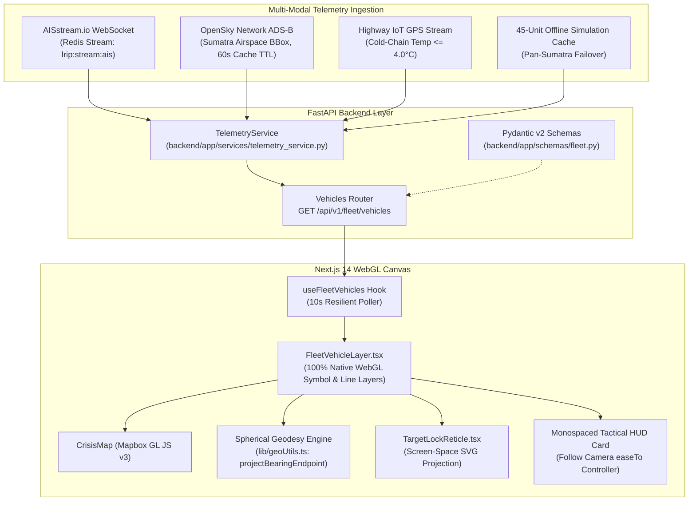

# Phase 39: Tactical Multi-Modal Telemetry & God's-Eye HUD Console — Walkthrough & Feature Guide

**Milestone:** M2 — PreHub Final Defense  
**Phase:** 39  
**Status:** COMPLETE ✅  
**Date:** 2026-09-27  

---

## 1. Feature Walkthrough & Operator Interaction Guide

### A. Real-Time Multi-Modal Asset Ingestion & Rendering
- **Maritime Fleet (Blue Sky `#38bdf8` / `vessel-icon`):**
  - Displays AISstream transponder metadata: MMSI, IMO, SOG (knots), COG (degrees), Draught (meters), and Navigational Status.
  - Positioned along verified Sumatra coastal nautical lanes (Selat Malaka, Selat Sunda, Pantai Barat, Teluk Bayur, Belawan, Panjang).
- **Air Freight Cargo (Purple `#c084fc` / `plane-icon`):**
  - Displays OpenSky ADS-B transponder data: ICAO24 hex address, Flight Callsign, Altitude (ft), and Ground Speed (knots).
  - Traverses aerial logistics corridors across Kualanamu (KNO), Minangkabau (PDG), Sultan Mahmud Badaruddin II (PLM), and Radin Inten II (TKG).
- **Arterial Highway Trucks (Emerald `#34d399` / `truck-icon`):**
  - Visualizes dynamic polyline progression with cold-chain IoT temperature sensors ($\le 4.0^\circ\text{C}$ green pill `[NORMAL]`, $> 4.0^\circ\text{C}$ amber pill `[PERINGATAN SUHU]`).

---

### B. Interactive God's-Eye Tactical HUD & Target Lock Reticle
1. **Target Selection (Point & Click):**
   - Click any vehicle or vessel icon on the Mapbox canvas.
   - The WebGL engine fires `fleet-telemetry-points-layer` click handler, locking onto the asset.
2. **Screen-Space Tactical Reticle (`TargetLockReticle.tsx`):**
   - High-contrast 10px `#00f0ff` cyan corner brackets, center target pip, 4 cardinal orientation ticks, and an animated breathing pulse overlay appear directly centered on the vehicle coordinates.
   - Includes a floating target callsign badge (e.g., `LOCKED: KM Sriwijaya Express`).
3. **Monospaced HUD Console Card:**
   - Appears docked at the top-left (`left-4 top-20`).
   - Displays real-time speed in knots & km/h, true azimuth heading angle with 8-point cardinal compass text (e.g., `124° SE`), elevation / draught, GPS coordinate readouts to 3 decimal places, strategic cargo manifest, and live telemetry ping latency.
4. **Target Follow-Camera Controller:**
   - Clicking **"Aktifkan Kamera Pengikut"** smoothly eases the 3D Mapbox camera (pitch $35^\circ\text{--}45^\circ$, zoom $\ge 9.5$) and continuously tracks the vehicle's forward travel.
   - **Safety Feature:** If the operator manually clicks and drags the map, `map.on('dragstart')` instantly disengages follow mode without input fighting.
5. **Target Dismissal:**
   - Clicking **"Lepas Kunci Target"** or the top-right close icon clears the target lock and resets the reticle.

---

### C. Floating Modality Filter Bar
- Positioned at the top center of the 4D Map.
- Allows 1-click filtering between:
  - **SEMUA (45 Unit)**
  - **TRUK (Ground Logistics)**
  - **KAPAL (Maritime AIS)**
  - **UDARA (Air Cargo ADS-B)**

---

## 2. Technical Implementation Architecture

---

## 3. Verification & Validation Summary

- **Automated Backend Pytest Suite:** 79/79 passed across 10 test modules.
- **Dedicated Telemetry Tests (`test_vehicles_telemetry.py`):**
  - `test_fleet_telemetry_schema_validation`: Passed ✅
  - `test_vehicles_endpoint_filtering`: Passed ✅
  - `test_cold_chain_threshold_evaluation`: Passed ✅
  - `test_telemetry_service_cache_resilience`: Passed ✅
- **Frontend Code Quality:**
  - TypeScript Compilation: 0 errors (`tsc --noEmit`).
  - ESLint Static Analysis: 0 warnings.
  - Next.js Production Build: 7/7 routes compiled cleanly.
- **Rendering Performance:** 60 FPS stable WebGL rendering under dynamic 3D camera rotation and pitch.
