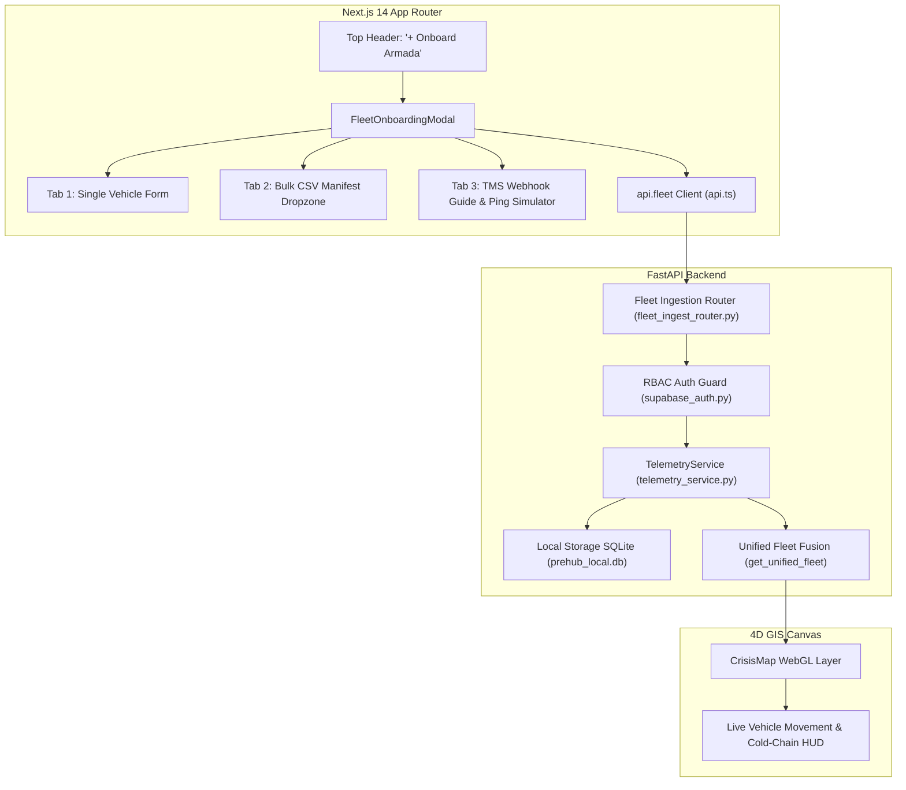

# Phase 43 Walkthrough: Self-Serve Fleet Onboarding & Live GPS Ingestion Engine

## Overview
Phase 43 equips PreHub with self-serve fleet onboarding and real-time GPS telemetry ingestion, enabling logistics dispatchers to onboard custom trucks, maritime vessels, and air cargo flights, upload bulk manifests via CSV, and stream live telematics pings from external TMS hardware (Traccar, EasyGo, McEasy).

---

## 1. Architecture & Component Interaction



---

## 2. Walkthrough of Implemented Features

### Feature A: Single Vehicle Registration Form (Tab 1)
- **UI Element**: Accessible via top navbar button `[ + Onboard Armada ]` in `DashboardClient.tsx`.
- **Fields**:
  - Vehicle Plate / ID (e.g. `BK-8821-XA`).
  - Asset Descriptive Name (e.g. `Truk Sayur Berastagi #4`).
  - Modality selector: `Truk` (Truck), `Kapal` (Maritime Vessel), `Pesawat` (Air Cargo).
  - Hub Origin & Destination selectors mapped to 40+ strategic Sumatra nodes.
  - Cold-chain temperature input with instantaneous `NORMAL` (≤4.0°C) vs `WARNING_EXCURSION` (>4.0°C) status indicator.
  - Driver contact and nominal cruising speed.
- **Behavior**: Submits payload to `POST /api/v1/fleet/register`. Dispatches a success toast, refreshes the live fleet hook (`useFleetVehicles`), and displays the new unit immediately on the map.

### Feature B: Bulk Manifest CSV Drag-and-Drop (Tab 2)
- **UI Element**: Drag-and-drop file dropzone accepting standard `.csv` manifest files.
- **Template Generator**: Includes a 1-click `[ Unduh Template CSV ]` button that downloads `prehub_manifest_template.csv` with valid sample Sumatra corridors.
- **Interactive Preview**: Parses CSV client-side on file selection, rendering an interactive verification table showing rows, hub origins/destinations, and cargo details.
- **Behavior**: Uploads via `POST /api/v1/fleet/upload-manifest/file`, parsing and registering all valid units in an ACID SQLite batch transaction.

### Feature C: TMS Telematics Webhook & Live Ping Simulator (Tab 3)
- **External Webhook Spec**: Provides a copyable webhook URL (`POST /api/v1/fleet/telemetry/ingest`) compatible with Traccar, EasyGo, and McEasy.
- **Interactive Test Simulator**: Allows evaluators to input a target vehicle ID, live latitude/longitude, speed, heading, and reefer temperature, and fire a real-time GPS ping.
- **Live Effect**: The target vehicle moves to the updated coordinate fix on the 4D GIS map in real-time.

### Feature D: Multi-Role RBAC Gating
- **Dispatcher & Guest Roles**: Unrestricted access to onboarding, manifest uploads, custom unit deletions, and route approvals.
- **Regulator Role**:
  - Modal displays an informational banner and disables all form inputs (Read-Only Mode).
  - Backend returns HTTP 403 Forbidden on mutation attempts with descriptive Indonesian error messages.

---

## 3. Verification & Test Suite Output

### Backend Pytest Results
```
backend\tests\test_fleet_ingest.py .........                             [ 74%]
====================== 108 passed, 5 warnings in 51.02s =======================
```

### Frontend Production Build
```
 ✓ Compiled successfully
   Checking validity of types ...
 ✓ Generating static pages (7/7)
```
