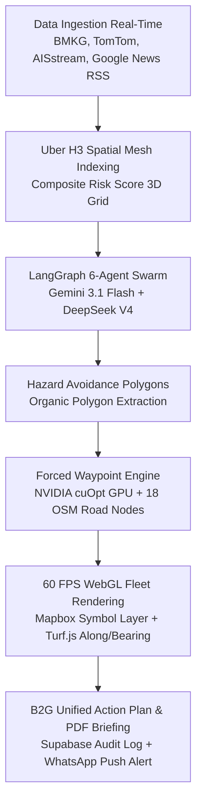

# DEMO SCRIPT 90-SECOND (PITCH PRODUCT WALKTHROUGH) — PETANADI (LRIP)

**Target Duration:** 90 Seconds (1.5 Minutes)  
**Pitchman Role:** Live Product Demo & Core Value Proposition  
**Scope Context:** Intro, Problem Statement, ROI, and CTA handled separately by teammates.  
**Platform URL:** `http://localhost:3000/dashboard` or `http://localhost:3000/` (Command Center)  

---

## ⏱️ TIMELINE & DIALOGUE BREAKDOWN (EXACT 90 SECONDS)

```
┌────────────────────────────────────────────────────────────────────────────────────────┐
│ [0:00 - 0:15]  Disruption Scenario & 4D Spatiotemporal Mesh                            │
│ [0:15 - 0:40]  Direct 2-Node Route Picking & Forced Waypoint Engine (No AI Hallucination)│
│ [0:40 - 1:05]  Multi-Alternative Routes, 60 FPS WebGL Fleet & Economic Risk Copilot   │
│ [1:05 - 1:30]  B2G Unified Action Plan Deploy & Technical Architecture Power Punch      │
└────────────────────────────────────────────────────────────────────────────────────────┘
```

---

### SEGMENT 1: Disruption Scenario & 4D Spatiotemporal Mesh (0:00 – 0:15)

* **Visual UI State:**  
  Tampilan awal PetaNadi Command Center (Mapbox 3D dark canvas). Kamera meluncur (*cinematic fly-to*) ke Koridor Sumatera Utara (Pelabuhan Belawan ➔ Medan ➔ Tebing Tinggi/Siantar). Terlihat poligon organis merah bencana banjir BMKG/InaRISK & heksagon 3D Uber H3 Composite Risk Score.
* **Action UI:**  
  Hover singkat pada poligon bencana banjir Belawan untuk menampilkan telemetry badge real-time.
* **Spoken Pitch Dialogue (Naskah Suara):**  
  > *"Ini adalah PetaNadi Command Center. Saat banjir atau cuaca ekstrem melumpuhkan koridor logistik utama seperti Pelabuhan Belawan, sistem konvensional butuh berjam-jam untuk mitigasi. PetaNadi mengintegrasikan data BMKG, TomTom, dan Google News secara real-time ke dalam indeks spasial H3 untuk mendeteksi ancaman secara presisi."*

---

### SEGMENT 2: Direct 2-Node Route Picking & Forced Waypoint Engine (0:15 – 0:40)

* **Visual UI State:**  
  Pengguna memilih titik asal dan tujuan langsung di atas peta interaktif. Titik **🟢 Start (Belawan)** dan **🟡 End (Siantar)** menyala di peta.
* **Action UI:**  
  Klik node **🟢 Belawan Port**, lalu klik node **🟡 Siantar / Tebing Tinggi Hub**. Rute merah terputus akibat menembus poligon bencana.
* **Spoken Pitch Dialogue (Naskah Suara):**  
  > *"Operator cukup memilih titik asal dan tujuan langsung di atas peta. Berbeda dengan AI biasa yang sering berhalusinasi rute fiktif, Forced Waypoint Engine kami langsung mengunci jalan ke 18 node arteri OSM nyata dan secara mutlak memutus rute yang menembus poligon bencana."*

---

### SEGMENT 3: Multi-Alternative Routes, 60 FPS WebGL Fleet & Economic Risk (0:40 – 1:05)

* **Visual UI State:**  
  Sistem menyajikan 3 opsi rute evakuasi. Tab rekomendasi `(Best)` terpilih otomatis. Truk logistik 3D bergerak mulus di atas rute hijau melingkari poligon banjir. Di sidebar kiri, AI Copilot menampilkan peringatan lonjakan harga cabai/bawang merah (+18.5%).
* **Action UI:**  
  Klik rute `(Best)` pada tab rute alternatif. Hover armada truk untuk menampilkan telemetry tooltip 60 FPS.
* **Spoken Pitch Dialogue (Naskah Suara):**  
  > *"Dalam hitungan milidetik, sistem memberikan 3 rute evakuasi presisi yang memutari area krisis. Armada logistik bergerak mulus 60 FPS di atas layer WebGL Native, sementara Economic Intelligence Agent langsung memprediksi dampak lonjakan harga bahan pokok akibat keterlambatan ini."*

---

### SEGMENT 4: B2G Unified Action Plan Deploy & Technical Power Punch (1:05 – 1:30)

* **Visual UI State:**  
  Klik tombol `[ 🚀 DEPLOY UNIFIED ACTION PLAN ]`. Terbit notifikasi Toast hijau, log approval tercatat di database Supabase, lalu beralih ke halaman **Reports / Cabinet Briefing** untuk menampilkan ekspor PDF dokumen resmi.
* **Action UI:**  
  Klik `[ 🚀 DEPLOY UNIFIED ACTION PLAN ]` ➔ pindah singkat ke tab `REPORTS` ➔ tunjukkan skor dampak ekonomi yang dimitigasi (IDR 4.2B).
* **Spoken Pitch Dialogue (Naskah Suara):**  
  > *"Dengan satu klik, instruksi rute resmi langsung dikirimkan ke otoritas gabungan BULOG, DISHUB, dan BNPB lengkap dengan audit log Supabase. Dibalik layar, PetaNadi ditenagai NVIDIA cuOpt GPU Solver, prediksi cuaca NVIDIA FourCastNet, dan LangGraph agent swarm. PetaNadi mentransformasi manajemen krisis logistik dari reaktif menjadi preventif berbasis data!"*

---

## 🏗️ MERMAID ARCHITECTURE DIAGRAM (FOR PRESENTATION / ONBOARDING SCREEN)



---

## 🛠️ PANDUAN EKSEKUSI REKAMAN DEMO (3 OPSI IMPLEMENTASI)

### OPSI A: Built-In Guided Demo Runner + OBS (SANGAT DIREKOMENDASIKAN ⚡)
PetaNadi **SUDAH MEMILIKI** fitur demo runner interaktif bawaan di UI yang dibuat di Phase 23 & 29:
1. Buka `http://localhost:3000/dashboard` di browser Chrome/Edge.
2. Buka OBS Studio / Windows Game Bar (`Win + Alt + R`).
3. Klik tombol **`▶ Run Demo`** di bagian bawah dasbor.
4. Sistem akan secara otomatis menjalankan 5-stage walkthrough dengan pergerakan kamera Mapbox 3D, pengalihan rute, dan progress 6 agen swarm secara sempurna tanpa glitch!

### OPSI B: Playwright Automated Screen Recorder Script
Jika ingin otomatisasi browser headless/headed 100% presisi:
Jalankan file Playwright recorder: `frontend/e2e/demo-recorder.spec.ts`
```bash
cd frontend
npx playwright test e2e/demo-recorder.spec.ts --headed
```

### OPSI C: HyperFrames CLI Render
Jika ingin komposisi frame-by-frame HTML to MP4 studio-grade:
```bash
npx hyperframes init demo-video
npx hyperframes render
```
