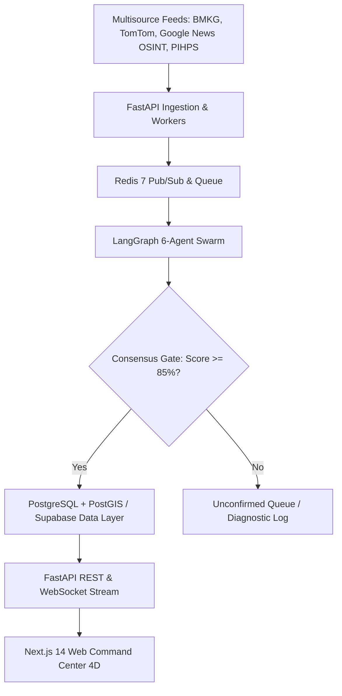

# 📜 Product Requirement Document (PRD) — PreHub

**Platform Name:** PreHub (*Predictive Logistics Hub & Early Warning Decision Support System*)  
**Target Region:** North Sumatra Strategic Corridor (Pelabuhan Belawan ↔ Kota Medan ↔ Jalan Tol Medan-Tebing Tinggi ↔ Pematang Siantar)  
**Version:** 1.0.0-PROD (Stage 3 Official Release)  
**Last Updated:** 2026-08-16  

---

## 1. Product Overview & Core Value Proposition

### 1.1 Executive Summary
**PreHub** adalah sistem pendukung keputusan (*Decision Support System - DSS*) dan intelijen rantai pasok pangan berbasis *Multi-Agent Swarm* dan data multi-sumber (*weather, traffic, OSINT news, and commodity price variances*). PreHub mentransformasi manajemen krisis distribusi pangan dari pendekatan **reaktif-manual** menjadi **prediktif-preskriptif otomatis**.

### 1.2 Core Value Proposition
* **Multi-Source Corroboration (Evidence Chain):** Menggabungkan telemetri cuaca BMKG/FourCastNet, arus lalu lintas TomTom, dan berita daring OSINT yang diverifikasi silang untuk mengeliminasi peringatan palsu (*false alarms*).
* **Mathematical Risk Formulation:** Mengkuantifikasi risiko operasional:
  $$\mathcal{R} = P_{\text{disruption}} \times \left( \alpha \cdot \Delta T_{\text{delay}} + \beta \cdot \Delta C_{\text{fuel}} + \gamma \cdot V_{\text{perishability}} \right)$$
* **Actionable Tri-Option Mitigations:** Memberikan rekomendasi rute alternatif berbasis GPU (NVIDIA cuOpt / Mapbox) dengan opsi terukur: **Continue** (lanjutkan), **Reroute** (alihkan rute), atau **Hold/Delay** (tahan di buffer gudang terdekat).
* **Unified Multi-Agency Action Plan:** Draf disposisi resmi terpadu untuk Badan Pangan Nasional (BAPANAS), Kementerian Perhubungan, Perum BULOG, dan Kepolisian/DISHUB.

---

## 2. Feature Implementation & System Matrix

| Modul / Komponen | Status | Detail Implementasi & Sumber Data |
|:---|:---:|:---|
| **Swarm Consensus Engine** | **Dynamic** 🟢 | Logika konsensus 6 agen di `consensus_gate.py` dengan batasan skor $\ge 85\%$ dan $\ge 2$ sumber independen aktif. |
| **Command Center 4D Map** | **Dynamic** 🟢 | Mapbox GL v3 + WebGL 60 FPS route-bound fleet vector layer dengan interpolasi posisi dan rotasi bearing akurat. |
| **Evidence Chain Drawer** | **Dynamic** 🟢 | `CrisisSidebar.tsx` menyajikan telemetri BMKG, TomTom speed delta, dan tautan berita terverifikasi dengan skor keyakinan AI. |
| **Spatial Economic Analytics** | **Dynamic** 🟢 | Deck.gl Arc & Scatterplot visualisasi aliran komoditas pangan dan grafik disparitas harga pasar PIHPS. |
| **Multi-Agency Simulation Sandbox** | **Dynamic** 🟢 | `SimulationSection.tsx` menyediakan pengujian skenario bencana kustom (Shockwave 5-50 km) dan orkestrasi rencana aksi gabungan. |
| **B2G Cabinet Briefing Center** | **Dynamic** 🟢 | `ReportsSection.tsx` menghasilkan berkas laporan eksekutif siap cetak (*Print PDF*) dan ekspor JSON untuk integrasi BAPANAS. |
| **Unified 1-Click Launchers** | **Dynamic** 🟢 | `start.bat` dan `start.ps1` untuk menjalankan backend FastAPI dan frontend Next.js secara simultan. |

---

## 3. System Architecture & Multi-Agent Swarm

---

## 4. Operational KPIs & Quality Gates

* **Zero Build Error:** Next.js `npm run build` mengompilasi 7/7 *static pages* dengan 0 error.
* **Test Coverage:** Seluruh 34 unit & integration test pada backend lulus (`pytest` 100% pass rate).
* **Automated Visual Verification:** Playwright E2E test suite (`capture-screenshots.spec.ts`) memvalidasi seluruh 7 tampilan sistem.
* **Respon Waktu Nyata:** Waktu tunda perutean cuOpt $< 1.5$ detik untuk skenario pengalihan konvoi multi-truk.
