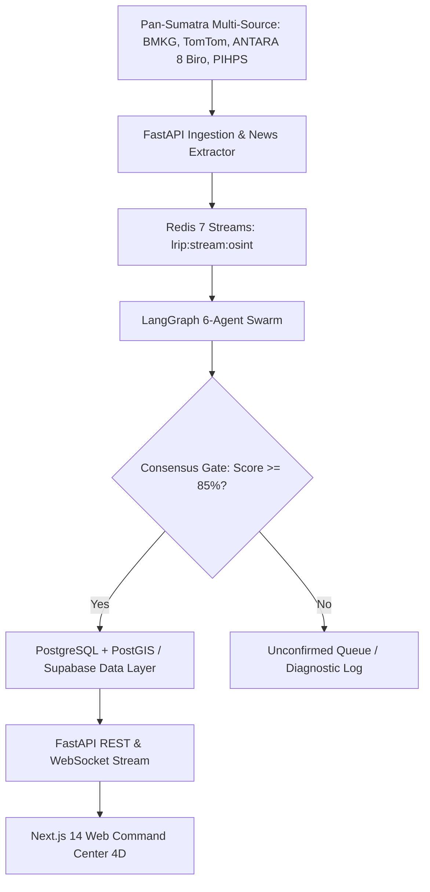

# 📜 Product Requirement Document (PRD) — PreHub

**Platform Name:** PreHub (*Predictive Logistics Hub & Early Warning Decision Support System*)  
**Platform Name:** PreHub (*Predictive Logistics Hub & Early Warning Decision Support System*)  
**Target Region:** Pan-Sumatra Strategic Food Logistics Corridors (8 Mainland Provinces: Sumatera Utara, Sumatera Barat, Riau, Aceh, Sumatera Selatan, Lampung, Jambi, Bengkulu; plus Coastal Maritime Sea-Lanes & Air Cargo Routes)  
**Version:** 2.0.0-PROD (Pan-Sumatra Multi-Outlet News & Early Warning Release)  
**Last Updated:** 2026-09-22  

---

## 1. Product Overview & Core Value Proposition

### 1.1 Executive Summary
**PreHub** adalah sistem pendukung keputusan (*Decision Support System - DSS*) dan intelijen ketahanan rantai pasok pangan berbasis *Multi-Agent Swarm* dan data multi-sumber (*weather, traffic, Pan-Sumatra multi-outlet news intelligence, and commodity price variances*). PreHub mentransformasi manajemen krisis distribusi pangan di seluruh Pulau Sumatera dari pendekatan **reaktif-manual** menjadi **prediktif-preskriptif otomatis**.

### 1.2 Core Value Proposition
* **Pan-Sumatra Multi-Source Corroboration:** Menggabungkan telemetri cuaca BMKG, arus lalu lintas TomTom, ingesti berita resmi 8 biro LKBN ANTARA regional, dan disparitas harga PIHPS Bank Indonesia untuk mengeliminasi peringatan palsu (*false alarms*).
* **Pre-Disruption Lead Time (3–6 Jam):** Ekstraksi NLP buletin berita dan peringatan dini cuaca memberikan jeda waktu respons sebelum disrupsi fisik memutus jalan arteri.
* **Mathematical Risk Formulation:** Mengkuantifikasi risiko operasional rantai pasok:
  $$\mathcal{R} = P_{\text{disruption}} \times \left( \alpha \cdot \Delta T_{\text{delay}} + \beta \cdot \Delta C_{\text{fuel}} + \gamma \cdot V_{\text{perishability}} \right)$$
* **Actionable Tri-Option Mitigations:** Memberikan rekomendasi mitigasi multimoda (*Continue*, *Reroute* dengan dynamic edge penalty $\times 5.0$, atau *Hold/Delay* di buffer hub terdekat) yang memetakan seluruh jaringan jalan tol (JTTS), jalan arteri nasional (Jalintim, Jalinbar, Jalinteng), jalur laut ALKI, dan kargo udara.
* **Unified Multi-Agency Action Plan:** Draf disposisi resmi terpadu untuk Badan Pangan Nasional (BAPANAS), Kementerian Perhubungan, Perum BULOG, dan Kepolisian/DISHUB dengan kutipan bukti berita terverifikasi.

---

## 2. Feature Implementation & System Matrix

| Modul / Komponen | Status | Detail Implementasi & Sumber Data |
|:---|:---:|:---|
| **Pan-Sumatra News Intelligence Engine** | **Dynamic** 🟢 | Ingesti XML RSS 8 biro LKBN ANTARA regional + ANTARA Ekonomi + NLP Gemini Flash & Gazetteer Pulau Sumatera (`/api/v1/news/live`, `/api/v1/news/market-regime`). |
| **Autonomous Swarm Dispatcher** | **Dynamic** 🟢 | Pemicu otonom latar belakang saat mendeteksi penutupan jalan kritis (`lane_status: BLOCKED` / `severity: critical`) dengan deduplikasi `_TRIGGERED_NEWS_IDS`. |
| **Swarm Consensus Engine** | **Dynamic** 🟢 | Logika konsensus 6 agen di `consensus_gate.py` dengan batasan skor $\ge 85\%$ dan $+0.15$ boost untuk sumber resmi Tier 1. |
| **Command Center 4D Map** | **Dynamic** 🟢 | Mapbox GL v3 + WebGL 60 FPS route-bound fleet vector layer (45 unit armada multimoda di seluruh koridor Sumatera). |
| **Evidence Chain & Provenance Drawer** | **Dynamic** 🟢 | `EvidenceTab.tsx` menyajikan telemetri BMKG, TomTom speed delta, dan badge resmi LKBN ANTARA dengan lead-time peringatan dini. |
| **Spatial Economic Analytics** | **Dynamic** 🟢 | Visualisasi disparitas harga komoditas strategis (beras, cabai, bawang, minyak) di pasar-pasar induk Pulau Sumatera. |
| **Multi-Agency Simulation Sandbox** | **Dynamic** 🟢 | `SimulationSection.tsx` menyediakan pengujian skenario bencana kustom (Shockwave 5-50 km) dan orkestrasi rencana aksi gabungan. |
| **B2G Cabinet Briefing Center** | **Dynamic** 🟢 | `ReportsSection.tsx` menghasilkan berkas laporan eksekutif siap cetak (*Print PDF*) dan disposisi BAPANAS dengan kutipan bukti media. |
| **Unified 1-Click Launchers** | **Dynamic** 🟢 | `start.bat` dan `start.ps1` untuk menjalankan backend FastAPI dan frontend Next.js secara simultan. |

---

## 3. System Architecture & Multi-Agent Swarm

---

## 4. Operational KPIs & Quality Gates

* **Zero Build Error:** Next.js `npm run build` mengompilasi 7/7 *static pages* dengan 0 error.
* **Test Coverage:** Seluruh 39 unit & integration test pada backend lulus (`pytest` 100% pass rate).
* **Automated Visual Verification:** Playwright E2E test suite memvalidasi seluruh tampilan antarmuka sistem.
* **Respon Waktu Nyata:** Waktu kalkulasi reroute $< 1.5$ detik untuk skenario pengalihan koridor lintas provinsi.
