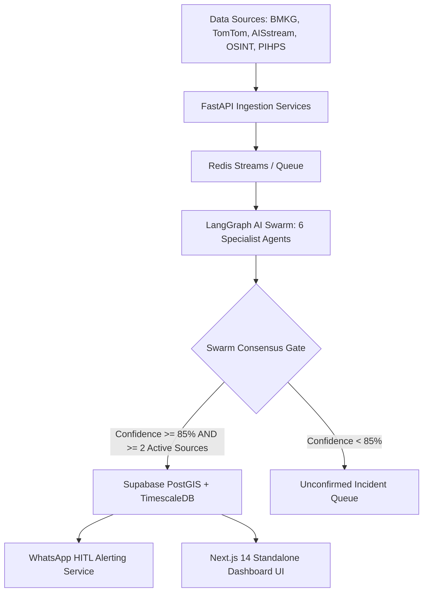

# 📜 Product Requirement Document (PRD) — PetaNadi

**Platform Name:** PetaNadi (Logistics Resilience & Intelligence Platform / LRIP)  
**Target Region:** North Sumatra Corridor (Pelabuhan Belawan ↔ Jalan Tol Medan-Tebing Tinggi ↔ Jalur Lintas Sumatra)  
**Version:** 1.2 (Stage 2 Hackathon & Digdaya 2026 Release)  
**Last Updated:** 2026-07-20  

---

## 1. Product Overview & Core Value Proposition

### 1.1 Executive Summary
**PetaNadi** adalah platform intelijen ketahanan logistik dan respons krisis bencana berbasis AI Swarm multi-agent. PetaNadi memantau, memprediksi, dan memitigasi gangguan pasokan komoditas pangan dan jalur transportasi di koridor strategis Sumatra Utara secara *real-time*.

### 1.2 Core Value Proposition
* **Resiliensi Rantai Pasok Pangan:** Menghubungkan dinamika cuaca ekstrem (BMKG), kemacetan jalan tol (TomTom), antrean pelabuhan (AISstream), dan laporan publik (OSINT) dengan lonjakan harga komoditas utama (beras, minyak goreng, cabai merah) melalui analisis variansi inflasi.
* **Pengambilan Keputusan Otonom Terverifikasi:** Menggunakan agen AI Swarm terdistribusi (6 agen spesialis) yang dipagari oleh **Consensus Gate Validator** untuk memastikan hanya peringatan dan saran rute terverifikasi tinggi yang diteruskan ke operator lapangan (BULOG, DISHUB, BNPB).
* **Mitigasi Proaktif & Hemat Biaya:** Menyediakan rekomendasi pengalihan rute armada (detour) yang meminimalkan durasi keterlambatan, konsumsi bahan bakar, emisi CO₂, dan potensi kerugian ekonomi komoditas hingga miliaran Rupiah.

---

## 2. Feature Implementation Matrix (Dynamic vs Static Audit)

Berdasarkan audit komponen frontend & backend pasca-Phase 11 & Phase 12:

| Komponen UI / Sistem | Status Saat Ini | Detail Sumber Data / Implementasi |
|:---|:---:|:---|
| **Swarm Consensus Validation** | **Dynamic** 🟢 | Logika pembobotan terpusat di `consensus_gate.py` dengan batasan skor $\ge 85\%$ dan minimal $\ge 2$ sumber independen aktif (confidence $> 0.5$). |
| **Commodity Price History (Economic Tab)** | **Dynamic** 🟢 | Terhubung ke endpoint `GET /api/v1/commodities/prices` yang mengueri hypertable `commodity_prices` di Supabase TimescaleDB. |
| **Archipelago Inflation Heatmap & Delta** | **Dynamic** 🟢 | Komponen `AnalyticsSection.tsx` menampilkan harga acuan beras, delta harga cabai/bawang, dan 5 grafik batang variansi inflasi secara dinamis dari database. |
| **Emergency Advisor Sandbox Chat** | **Dynamic** 🟢 | Komponen `SimulationSection.tsx` terhubung ke endpoint `POST /api/simulation/chat` untuk konsultasi taktis agen Decision Support berbasis `crisisId`. |
| **Executive Reports & Savings KPI** | **Dynamic** 🟢 | Komponen `ReportsSection.tsx` mengagregasi total penghematan biaya dari tabel `approvals` serta menghitung *System Operational Integrity Index* dari status *healthcheck* adapter. |
| **Sensory Evidence Chain** | **Dynamic** 🟢 | Komponen `EvidenceTab.tsx` membaca log CCTV visual, cuitan OSINT geocoded, dan grafik matriks penundaan waktu dari payload `crisis.evidence`. |
| **Guided Demo Runner & Stepper** | **Dynamic** 🟢 | Komponen `GuidedDemoPanel.tsx` & `useDemoState.ts` terhubung ke `/api/demo/start` & `/api/demo/advance` dengan fallback otomatis ke fixture offline lokal (`belawan-demo-offline`). |
| **Left Sidebar & Bottom Time Scope Controls** | **Dynamic** 🟢 | Navigasi sidebar terikat ke tab kontrol (`activeTab`) dan filter waktu (PAST, PRESENT, FUTURE, PREDICT) terikat ke dataset insiden dan lokasi geocoded. |
| **Raw Fleet Telemetry & Live Traffic Stream** | *Mock Fallback* 🟡 | Peta menampilkan array koordinat statis (`STUB_MARITIME`, `STUB_FIRE_HOTSPOTS`) dan data fixture simulasi untuk layer maritim & titik api (Dijadwalkan untuk v2). |

---

## 3. System Architecture & Technical Complexity

### 3.1 Swarm Consensus & Rule Cross-Validation
* **Threshold Rules:** Setiap bencana/kejadian krisis wajib dievaluasi oleh 6 agen spesialis (*Data Collection, OSINT Hazard, Prediction, Route Optimization, Economic Intel, Decision Support*).
* **Aturan Pembobotan Rigor:** Krisis hanya ditandai sebagai `validated` jika skor agregat $\ge 85\%$ **DAN** sekurang-kurangnya 2 sumber data independen (misal: cuaca BMKG + lalu lintas TomTom) mendeteksi sinyal positif dengan tingkat keyakinan $> 0.5$.
* **Kepatuhan Privasi (UU No. 27/2022 PDP):** Sistem tidak mengumpulkan data pribadi (PII). Seluruh log operator menggunakan identifier anonim (`operator_id: "anonymous"`).

### 3.2 Backend Infrastructure
* **FastAPI Backend (Python 3.10):** REST API & WebSocket server yang mengelola antrean simulasi, webhook WhatsApp, dan kueri analisis komoditas.
* **Supabase (PostgreSQL 15 + PostGIS + TimescaleDB + pgvector):** Hypertable untuk data deret waktu harga pangan, kueri spasial untuk polygon terdampak bencana, dan enkripsi data *at-rest* (AES-256).

### 3.3 Frontend Architecture
* **Next.js 14 (App Router, Standalone Mode):** Rendering komponen responsif berbasis Vanilla CSS & Stitch Unified Design System.
* **Dynamic Viewport & 3D Mapping:** Menggabungkan Mapbox GL JS v3 dan Deck.gl v9.3 dengan WebSocket streaming untuk pembaruan layer insiden real-time.

---

## 4. Phase 12 Accomplishments & Post-Hackathon Roadmap

### 4.1 Accomplishments in Phase 12 (UI/UX Refinement & Runtime Fixes)
1. **Pembersihan Overlap Header & Sidebar:** Memperbaiki posisi `CrisisSidebar` ke `fixed top-20 right-6 max-h-[calc(100vh-12rem)] z-40`, menghilangkan tumpang tindih dengan header navbar fixed (`UTC+00:00`).
2. **Animasi Transisi Sidebar Kiri:** Menambahkan `transition-all duration-300 ease-in-out` dan kemunculan teks berbasis opacity pada menu navigasi samping.
3. **Pemberesan Event Handler & Route Endpoint:** Memperbaiki prefix router backend (`/api/demo/start`) dan menambahkan atribut `type="button"` serta `preventDefault()` pada seluruh tombol kontrol runner untuk mencegah reload halaman.

### 4.2 Post-Hackathon Roadmap (v2 & Enterprise Rollout)
* **Driver Mobile App:** Aplikasi React Native dengan integrasi WatermelonDB + CRDT offline sync untuk pengemudi truk komoditas.
* **Pipeline Telemetri Armada Live:** Integrasi langsung dengan API GPS kendaraan komoditas dan OpenSky aviation layer.
* **Ekspansi Multi-Provinsi:** Perluasan koridor dari Sumatra Utara ke koridor Pulau Jawa dan Sulawesi.
* **Enterprise GraphRAG Private Deployment:** Integrasi jaringan pengetahuan logistik terpusat menggunakan model LLM internal.

---

*PetaNadi — Navigasi Tangguh, Logistik Terjaga.*
