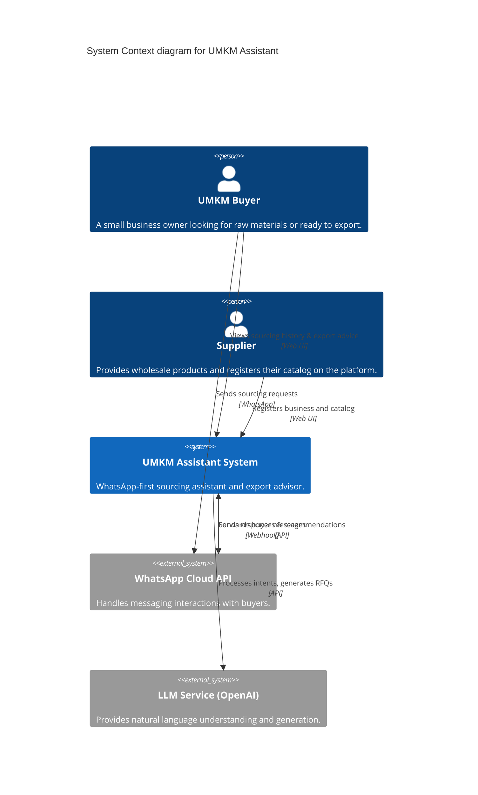
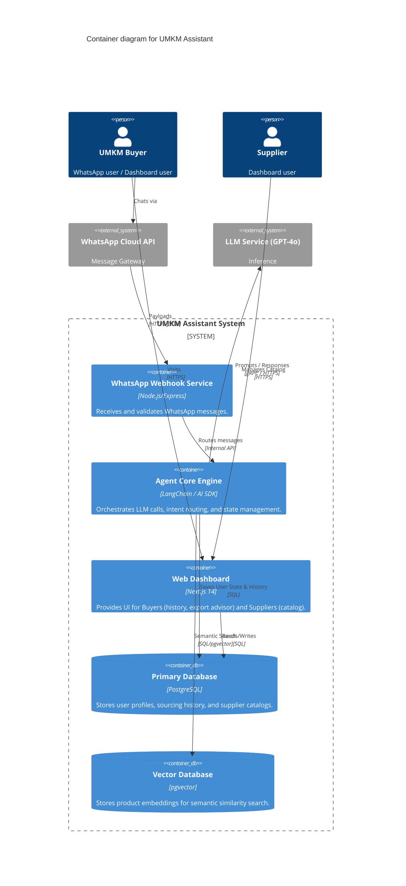
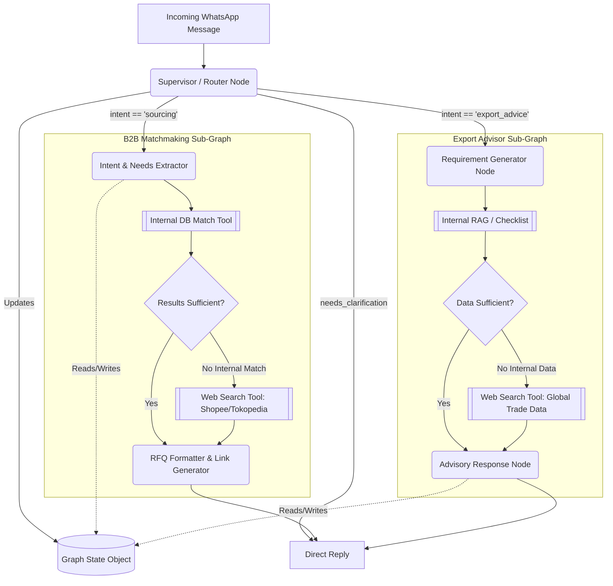
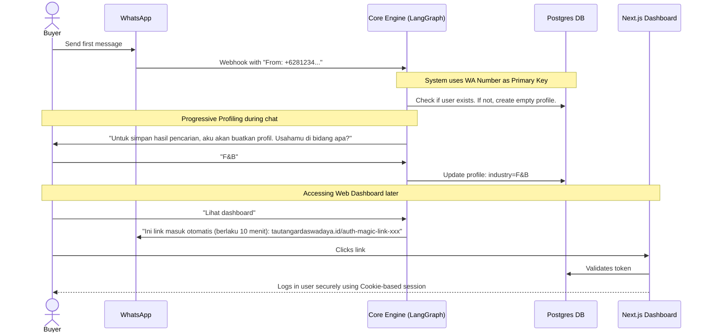
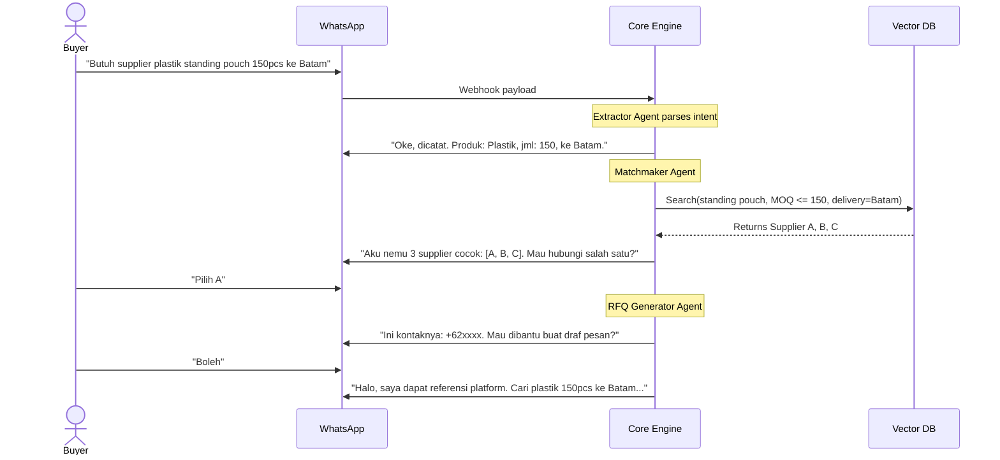
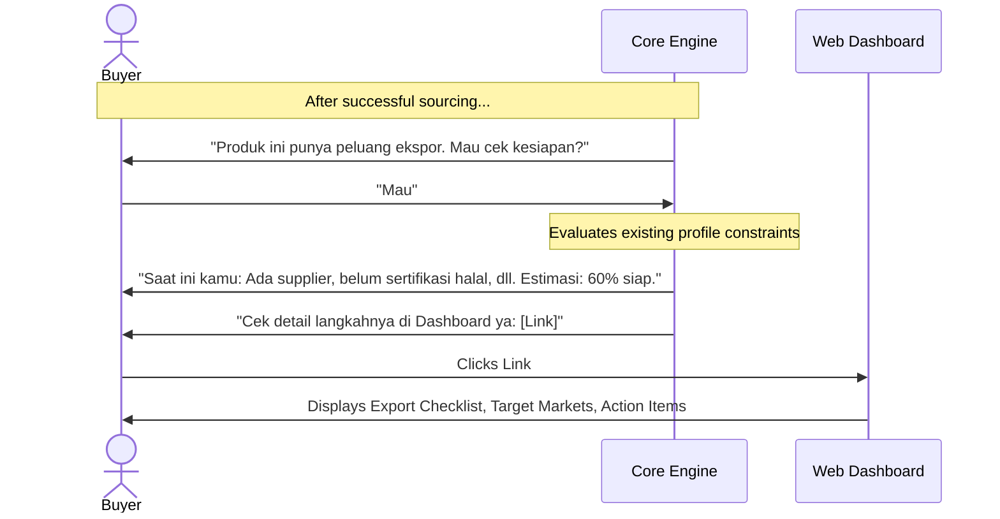

# 🏗️ UMKM Assistant Architecture

This document contains the System, Agent, and User Flow Architectures for the UMKM Assistant, designed with a "System-First" mindset to minimize technical debt and ensure scalability.

## 1. System Architectures (C4 Model)

### A. Context Level Diagram
This illustrates the high-level landscape and interactions.

### B. Container Level Diagram
This breaks down the `UMKM Assistant System` into deployable containers.

---

## 2. Agent Architecture (LangGraph + Gemini)

**CTO Architectural Decision**: We will *not* use nested autonomous sub-agents with broad tool access. In a WhatsApp environment, autonomous sub-agent loops introduce unpredictable latency, excessive token usage, and infinite loop risks. 
Instead, we use a **Deterministic StateGraph (LangGraph)**. A supervisor routes the intent to highly specialized, linear sub-graphs. This guarantees speed, reliability, and easy debugging during the hackathon.

---

## 3. User Flow Architecture

### A. Progressive Onboarding & Dashboard Access (Auth Flow)

### B. Sourcing & Matchmaking Flow (Buyer via WhatsApp)

### B. Export Advisory Flow (Integrated Follow-up)

