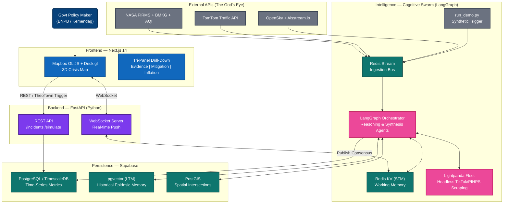

# Product Requirements Document (PRD) & Architecture Blueprint
**Project: PetaNadi (Pulse Map) — The "God's Eye" Economic Tracker**
**Version: 3.0 — The Cognitive Swarm Architecture**

> [!IMPORTANT]
> **Strategic Intent:** This document serves as the master blueprint for the Digdaya X Hackathon 2026. PetaNadi is NOT a simple database dashboard or a hollow API wrapper. It is a **True "God's Eye" Predictive System** powered by a stateful Multi-Agent LLM Swarm. It tracks physical disasters and predicts their cascading economic/inflationary impacts. The ultimate hackathon USP is the visually stunning 3D Mapbox UI and the **"TheoTown" Dual-Mode Engine**—where judges can watch live data, or aggressively drop a simulated disaster onto the map and watch the AI swarm calculate detours and inflation spikes in real-time.

---

## 1. Vision & System Philosophy

**The Problem:** Indonesia's national logistics are uniquely complex. Localized physical shocks — a flood on the Pantura toll road, a forest fire blocking a Sumatra highway, port congestion — instantly cascade into nationwide inflationary price spikes. Currently, decision-makers cannot "see the math" behind logistics failures until prices have already surged.

**The Solution:** PetaNadi treats natural disasters not just as physical events, but as **cascading economic shocks**. It uses a 4D interactive map to visualize the domino effect:

```
Physical Hazard (NASA/BMKG) → Logistics Bottleneck (TomTom/OpenSky/Aisstream) → LTM Context Query → Predicted Market Price Spike (PIHPS/Marketplaces)
```
When a crisis is clicked, a "Drill Down" sidebar expands, showing the **Evidentiary Consensus**—embedding the actual citizen video, the ATCS CCTV frame, and the precise Google Maps telemetry that triggered the alert.

**Hackathon Alignment:** 
Directly answers Problem Statement 2 (*Peningkatan Produktivitas, Ketahanan Pangan*) by acting as a *Logistik Pangan Cerdas* and *Pemantauan Inflasi* platform. It provides a "Prototype Fungsional" ready for Business Matching adoption by agencies like BNPB, Bappenas, or Kemendag.

---

## 2. Core Mechanics: The Dual-Mode "TheoTown" Engine

To maximize the "Wow" factor for the judges and prove the system works, PetaNadi operates in a seamless dual-state engine.

### Mode A: The Live Sentinel (Passive Watcher)
During normal operations, the system acts as a live heartbeat monitor for Indonesia's logistics. 
*   **Data Throttle (Daily):** The Ingestion Swarm conservatively scrapes official PIHPS (Gov Prices) and Marketplaces (Tokopedia/Shopee) once a day to establish a baseline. OpenSky (Flights), Aisstream (Sea), and TomTom (Roads) flow at normal, economical API rates. 
*   **Aggregation:** Data is stored in TimescaleDB to build historical averages month-over-month.

### Mode B: The "TheoTown" Simulation Sandbox (Active Trigger)
We merge the concept of an "Enterprise Sandbox" directly into the live UI. We introduce a **"Simulate Disaster" Tab**—a God-game mode that allows users (and judges) to literally "drop" a physical hazard (e.g., a Level 4 Flood Polygon) directly onto the live Mapbox dashboard.
*   **The Overdrive Trigger:** Dropping the disaster instantly forces the Swarm into Crisis Mode.
*   **Dynamic Scraping (15-Minute Bursts):** The Lightpanda Headless Swarm shifts from daily scraping to aggressive 15-minute intervals, frantically gathering real-time Tokopedia price hikes and TikTok ground-zero videos surrounding the blast radius.
*   **Automated Mitigation:** The system bypasses human analysis, calculates the detour, and forecasts the inflation damage matrix based on historical Long-Term Memory (LTM) matches.

### The Hackathon Survival Mechanism (`run_demo.py`)
In a live hackathon environment with 2000 teams destroying the Wi-Fi, relying exclusively on live Headless Scraping is risky. We will build `run_demo.py`, a script that injects massive synthetic anomalies (mocked NASA polygons, synthetic TomTom delays, pre-scraped PIHPS JSONs, and local TikTok MP4 segments) directly into the Redis streams as if it were a live crisis. This triggers the downstream AI Swarm perfectly, guaranteeing a flawless 3-minute pitch.

---

## 3. The Cognitive Swarm Architecture (LangGraph)

PetaNadi is a genuine reasoning engine justified by its Memory systems. It does not just output string text; it alters state.

### A. The Memory Architecture: LTM vs. STM
*   **Short-Term Memory (Working Memory / STM):** Managed via LangGraph `MemorySaver` (Redis). Holds the exact, ticking state of the current crisis across all agents. *(e.g., "Flood active in Demak, Pantura blocked, TomTom shows 10km jam, Scraper sees Shallots up 5%.")*
*   **Long-Term Memory (Episodic Memory / LTM):** Managed via **pgvector (Supabase)**. Stores high-dimensional semantic datasets of past Indonesian disasters and their specific inflation footprints. *(e.g., "If Pantura floods in Q1, historical data shows a 12% spike in Central Java food prices within 5 days.")*
*   **CAG (Cache-Augmented Generation):** Preloads complex system instructions, semantic bridge protocols, and baseline economic rules into the LLM’s 2M-token context window so agents can converse internally at lightning speed without constant RAG latency.

### B. The Agent Roster

#### 1. Ingestion & Intelligence Swarm
These agents evaluate realtime deltas against historical norms.
*   **Geospatial Traffic Agent:** Exclusively evaluates the **TomTom Traffic API** (replaces Google/Waze) against baselines to flag unnatural gridlock.
*   **Earth & Hazard Agent:** Fuses **NASA FIRMS** (Fire Data), **BMKG** (Weather/Earthquakes), and **AQI** (Air Quality Index) into explicit severity polygons.
*   **Logistics Network Agent:** Cross-references **OpenSky API** (aviation bottlenecks) and **aisstream.io** (maritime port congestion/queues).
*   **The Headless Scraping Fleet (Lightpanda):** Ultra-fast, autonomous browser agents optimized for LLMs.
    *   *Economic Wing:* Scrapes PIHPS, Tokopedia, Shopee.
    *   *Social Wing:* Scrapes TikTok iFrames and Twitter/X for ground-truth visuals and citizen journalism.

#### 2. Synthesis & Simulation Swarm
When Phase 1 detects an anomaly, it injects the event into STM and triggers Phase 2.
*   **Context & Memory Agent (The Bridge):** Reads the current crisis from STM, queries the LTM (`pgvector`) for the closest historical match, and injects the context into the other agents.
*   **Economic Simulation Agent:** Takes the traffic delay, the active Lightpanda scraped prices, and the LTM historical multiplier to generate a precise regional inflation forecast *(e.g., "Jakarta retail Shallots expected +15.3% over 48h")*.
*   **Routing & Mitigation Agent:** Utilizes NetworkX (Dijkstra's Algorithm) over local road subgraphs to map out alternative non-blocked supply routes, weighing travel time against cargo spoilage.
*   **Consensus Node (The Judge):** Weighs all findings (Hazard 30%, Visual/Social 20%, Geospatial 30%, LTM Economics 20%). If Confidence > 85%, it officially publishes the "Validated Crisis" and mitigations to the 3D Dashboard.

---

## 4. System Architecture (C4 Model)



---

## 5. The 4D User Flow & Evidentiary "Drill Down" (The USP)

This UI prevents the judges from thinking the AI is hallucinating. Transparency is key.

1.  **The 3D Canvas:** Uses **Mapbox GL JS + Deck.gl** to render hundreds of thousands of datapoints (Flight paths, Maritime vectors, TomTom congestion lines, NASA heatmaps) at 60 FPS without crashing the browser viewport.
2.  **The Timeline Scrubber (The 4th Dimension):** A playback bar at the bottom allowing the judge to "rewind" the UI to see how an economic shock unfolded hour-by-hour (Ingestion → Alert → Inflation Spike).
3.  **The Tri-Panel Evidentiary Sidebar:** When a crisis pin is clicked (or dropping a TheoTown disaster), the sidebar expands containing three tabs:
    *   **Tab 1: Evidence (Anti-Hallucination):** Shows the raw data the Swarm used (e.g., The TikTok scrape transcript, the TomTom delay graph, the NASA FIRMS heat signature).
    *   **Tab 2: Mitigation Detour:** Shows the alternative route dynamically routed by NetworkX.
    *   **Tab 3: Economic Fallout:** Displays the active PIHPS/Marketplace graphs and the predicted inflation arc generated by the Economic Agent referencing the LTM.

---

## 6. Technology Stack Summarized

*   **Logic & Routing:** FastAPI (Python backend), LangGraph.
*   **Headless Web Scraping:** Lightpanda (for PIHPS, Marketplaces, Socials). Designed to bypass anti-bot protections.
*   **Data Tier (Supabase):**
    *   PostgreSQL / Relational
    *   PostGIS (Geospatial math)
    *   TimescaleDB (Time-series flow of TomTom and Scraped prices)
    *   pgvector (LTM semantic storage)
*   **Frontend:** Next.js 14, Mapbox GL JS, Deck.gl, Vanilla CSS (Premium Glassmorphism).
*   **Messaging/STM:** Redis Streams (event ingestion) + Redis KV (STM state).

---

## 7. Scaling Strategy & Business Logic

### Scaling Roadmap: Phase 1 (Hackathon MVP)
- **Scope:** 1 Major Corridor (e.g., Pantura + Sea/Flight paths over Java).
- **Data:** Synthetic Demo Script (`run_demo.py`) + Living Map APIs.
- **Messaging:** We prove the architecture works perfectly on one corridor so the government knows it can scale to 38 provinces securely.

### B2G SaaS Licensing (Government Adoption)
- **Target:** BNPB, Kemendag, Bappenas, Provincial Governments.
- **Model:** Dashboard Licensing + "Simulation Engine" usage tiers. Allowing cross-ministry disaster planning and supply chain stress testing.

### B2B Supply Chain Intelligence (Logistics Operators)
- **Target:** E-Commerce, Wholesalers, Freight Forwarders (JNE, SiCepat).
- **Model:** API Endpoint Subscription. AI pushes "Route Optimization Alerts" *before* commercial delays lock entire fleets in gridlock, saving millions in daily operational costs.

---
*Document Status: v3.0 — The God's Eye Cognitive Swarm. Complete architectural overhaul matching the integration of Dual-Mode TheoTown simulation, comprehensive God's Eye APIs (NASA, TomTom, OpenSky), Lightpanda headless scraping, and explicit LTM/STM memory systems.*